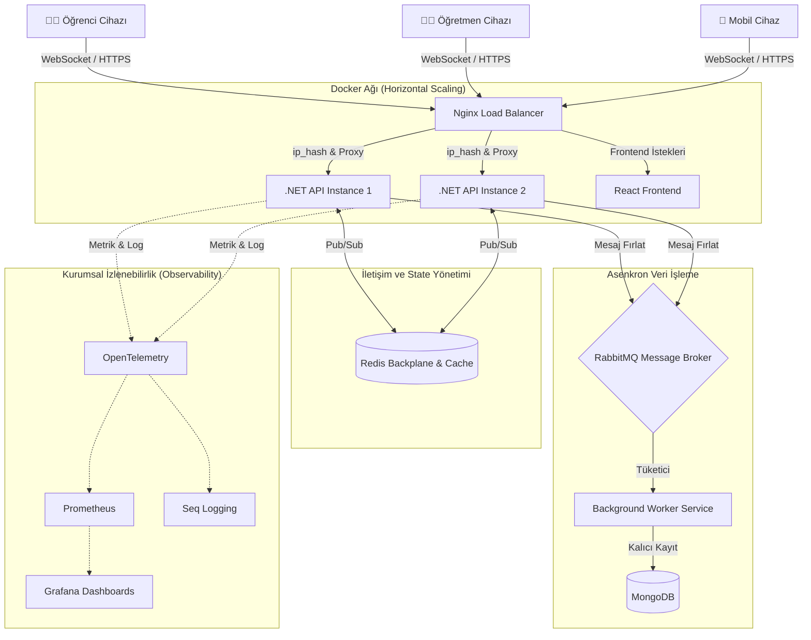

<div align="center">
  
# ⛰️ Kahoot Clone: Enterprise Distributed Architecture
**Dağıtık Sistemler Üzerinde Yükselen, Kesintisiz ve Gerçek Zamanlı Bilgi Yarışması Deneyimi**

[](https://dotnet.microsoft.com/)
[](https://react.dev/)
[](https://www.docker.com/)
[](https://redis.io/)
[](https://www.rabbitmq.com/)
[](https://www.sonarsource.com/)

*Bir dağ gibi uzaktan görkemli ve sarsılmaz, içine girildiğinde ise bir saat gibi kusursuz işleyen mikro-mekanizmalar.*

</div>

---

> [!NOTE] 
> **Felsefemiz: "Agentic Engineering"**
> Bu proje; Temiz Mimari (Clean Architecture), SOLID prensipleri ve Dağıtık Sistem (Distributed System) mühendisliğinin harmanlandığı, sıradan bir uygulamanın ötesinde **kurumsal (Enterprise)** standartlarda inşa edilmiş bir şaheserdir.

---

## 🗺️ Harita: İçindekiler
1. [Dağın Görünümü: Yüksek Seviye Mimari](#-dağın-görünümü-yüksek-seviye-mimari)
2. [Jeolojik Katmanlar: Teknoloji Yığını](#-jeolojik-katmanlar-teknoloji-yığını)
3. [Madenleri Keşfetmek: Temel Özellikler](#-madenleri-keşfetmek-temel-özellikler-ve-mühendislik)
4. [Kayaç Yapısı: Proje Mimarisi](#-kayaç-yapısı-proje-klasör-ve-mimari-yapısı)
5. [Kazıya Başlamak: Kurulum Rehberi](#-kazıya-başlamak-kurulum-ve-devops-rehberi)
6. [Hazineyi Çıkarmak: Kullanıcı ve Oyun Rehberi](#-hazineyi-çıkarmak-kullanıcı-ve-oyun-rehberi)
7. [Altın Standart: SonarQube ve Test Kapsamı](#-altın-standart-sonarqube-kod-analizi-ve-testler)

---

## ⛰️ Dağın Görünümü: Yüksek Seviye Mimari

Projenin dışarıdan bakıldığında en çarpıcı yanı, yükü mükemmel bir şekilde dağıtan ve asenkron işleyen mimarisidir. Sistem tek bir bilgisayarın belleğine hapsolmamış, kıtalar arası ölçeklenebilecek şekilde tasarlanmıştır.



---

## 💎 Jeolojik Katmanlar: Teknoloji Yığını

Her bir araç, projeye özel bir değer katmak üzere titizlikle seçildi. 

| Katman | Teknoloji | Görevi / Rolü |
| :--- | :--- | :--- |
| **Backend Çekirdeği** | C# .NET 10.0 Web API | Sistemin atan kalbi. Record ve Immutability patternleri ile state güvenliği. |
| **Gerçek Zamanlı İletişim** | SignalR + Redis Backplane | Milisaniyelik gecikmesiz soket iletişimi ve sunucular arası senkronizasyon. |
| **Durum (State) Yönetimi** | Redis (Dağıtık Önbellek) | Oyun durumunu RAM yerine merkezi, süper hızlı in-memory veritabanında tutma. |
| **Mesajlaşma (Event-Driven)** | RabbitMQ | Veritabanına yüklenmeden, işlemleri arka planda sessizce eritme. |
| **Veritabanı** | MongoDB | Oyun sonuçlarını ve raporları esnek, doküman tabanlı saklama. |
| **DevOps & Ölçekleme** | Docker & Nginx | Tam izolasyon ve gelen yükü (Trafik) API sunucularına eşit bölme (Load Balancing). |
| **Güvenlik** | JWT, Rate Limiting, Polly | Kimlik doğrulama, DDoS koruması ve geçici ağ kopmalarına karşı Retry mekanizmaları. |
| **İzlenebilirlik** | Prometheus, Grafana, Seq | CPU, RAM, Log ve Request metriklerini saniye saniye canlı takip etme. |
| **Frontend UI/UX** | React 19, TypeScript, Vite | Modern, akıcı, Dark/Light mode destekli, Premium kullanıcı deneyimi. |

---

## ⛏️ Madenleri Keşfetmek: Temel Özellikler ve Mühendislik

Bu proje sadece soruların ekrana geldiği basit bir yarışma değildir. Arka planda devasa sorunları (Concurrency, High-Availability, Fault-Tolerance) çözen mühendislik harikaları barındırır.

### 🌐 Dağıtık Mimari ve Redis Backplane
> Sistem tek bir sunucuya (RAM) bağlı değildir.

Klasik SignalR uygulamalarında oyuncular aynı sunucuya bağlanmak zorundadır. Ancak bu projede, **Redis Backplane** sayesinde sistem yüzlerce API örneğine (instance) bölünse bile; Öğrenci A Sunucusunda, Öğretmen B Sunucusunda olsa dahi oyun kusursuz bir şekilde eşzamanlı akar.

### 🔒 Güvenlik (JWT & Hile Koruması)
Öğrencilerin geliştirici konsolu (F12) üzerinden sahte komutlar gönderip (örneğin oyunu durdurma veya süreyi atlama) sistemi sabote etmesi, yalnızca oyun kurucuya (Yönetici) atanan **"Host Token"** mekanizması ile kesin olarak engellenmiştir.

### 🚦 Dağıtık Kilit (Distributed Lock - SETNX)
Birden fazla sunucu çalıştığında, *Oyun Döngüsünün (Tick)* veya *Süre Bitimi (Timeout)* işlemlerinin çakışıp oyunu iki defa işletmesini engellemek için Redis `SETNX` kullanılarak saniyelik görev kilitleri oluşturulmuştur. Aynı saniye içinde sadece bir sunucu liderliği alır ve görevi işler.

### ⏳ Heyecan Mekanizması (Suspense & Otomasyon)
Yönetici oyunu başlattığı an, yapay zeka ve arka plan servisleri (HostedService) dümeni devralır. Oyuncular cevap verdiğinde anında doğruyu görmek yerine "Bekleme Odası"na alınır. Süre bittiğinde, sonuçları tüm sınıf aynı anda, dramatik bir şekilde öğrenir.

### 🚀 Asenkron Yük Yönetimi
Oyun bittiğinde, yüzlerce öğrencinin logları ve sonuçları veritabanını kilitlemesin diye anlık kayıt yapılmaz. Veriler bir **RabbitMQ** kuyruğuna fırlatılır. Arka planda çalışan sessiz bir Worker Service, bunları alıp usulca MongoDB'ye işler. Bu sırada UI anında tepki verir, milisaniye bile beklemez.

### 🛡️ Sessiz Hata Kurtarma (Rejoin)
Ağ koptu mu? Tarayıcı yanlışlıkla mı kapandı?
SessionStorage ve Backend hafızası senkronizasyonu sayesinde, oyuncu veya yönetici tekrar girdiğinde **"Kaldığın Yerden Devam Et"** mantığıyla tam olarak koptuğu saniyeden oyuna geri döner.

---

## 🪨 Kayaç Yapısı: Proje Klasör ve Mimari Yapısı

Proje, bağımlılıkların içe doğru (Domain'e) aktığı, teknoloji bağımsız **Clean Architecture** kurallarına göre dizayn edilmiştir.

```text
KahootProjesi/
├── 📁 KahootClone.Domain         # Sistemin kalbi. Oyun, Soru, Oyuncu entity'leri. Dışa bağımlılık SIFIR.
├── 📁 KahootClone.Application    # İş mantığı, Puanlama kuralları, SignalR event arayüzleri.
├── 📁 KahootClone.Infrastructure # Kirli dünya. MongoDB bağlantıları, Redis cache implementasyonları.
├── 📁 KahootClone.Api            # Dış dünyaya açılan kapı. WebSocket Hub'ı, Controller'lar.
├── 📁 kahoot-frontend            # React 19 ile yazılmış, Vite ile ayağa kalkan Premium UI.
├── 📄 docker-compose.yml         # Tüm orkestrayı tek tuşla yönetecek şef.
└── 📄 sonar-analiz.bat           # SonarQube kod kalitesi için otomatik analiz betiği.
```

---

## ⛏️ Kazıya Başlamak: Kurulum ve DevOps Rehberi

Bu devasa sistemi bilgisayarınızda çalıştırmak için veritabanı uzmanı veya sistem yöneticisi olmanıza gerek yok. Sadece **Docker Desktop**'a ihtiyacınız var.

> [!TIP]
> **Ön Gereksinimler:** Docker Desktop ve Git kurulu olmalıdır.

### 1. Tek Tuşla Başlatma
Terminalinizi açın ve sadece şu komutu yazın:

```bash
git clone <projenin-github-linki>
cd KahootProjesi
docker-compose up --build -d
```
*Bu komut; API'yi derler, Frontend'i ayağa kaldırır, Redis, MongoDB, RabbitMQ, Seq, Prometheus ve Grafana'yı otomatik kurup birbiriyle konuşturur.*

### 2. Uygulamaya Erişim Portalları
`localhost` yerine bağlantı sorunlarını önlemek için yerel loopback IP adresi (`127.0.0.1`) önerilir:

- 🎮 **Ana Sayfa (Oyun):** `http://localhost:5173`
- 📚 **API Dokümantasyonu (Swagger):** `http://127.0.0.1:5252/swagger/index.html`
- 📊 **Metrik Görselleştirme (Grafana):** `http://127.0.0.1:3000` *(admin / admin)*
- 🐛 **Merkezi Loglama (Seq):** `http://127.0.0.1:5341`
- ⚙️ **Sistem İşlemcisi (Prometheus):** `http://127.0.0.1:9090`

### 3. Geliştirici Özel: Dağıtık Sistemi (Redis Backplane) Simüle Etme
Projenin gerçek gücünü görmek için, trafiği karşılayan API sayısını saniyeler içinde ikiye katlayın (Load Balancing Testi):

```bash
docker-compose up --scale api=2 -d
```
*Artık arkanızda iki farklı API sunucusu var. İstekleriniz Nginx üzerinden rastgele sunuculara düşecek ama oyun **Redis Backplane** sayesinde kesintisiz akmaya devam edecektir.*

---

## 💎 Hazineyi Çıkarmak: Kullanıcı ve Oyun Rehberi

### Markdown İle Sihirli Soru Oluşturma
Uygulamamız, metinleri saniyeler içinde dinamik sorulara dönüştüren özel bir Markdown derleyicisine sahiptir. Sorularınızı aşağıdaki formatta `.md` veya `.txt` olarak yazıp tek tıkla sisteme yükleyebilirsiniz:

```markdown
# Soru: Dağıtık sistemlerde "Cache" denince akla hangi teknoloji gelir?
Süre: 15
- MongoDB
- RabbitMQ
- Redis (*)
- Nginx

# Soru: Clean Architecture'da dış dünyadan tamamen izole olan en içteki katman hangisidir?
Süre: 20
- Application
- Domain (*)
- Infrastructure
- API
```

> [!WARNING] 
> **Dikkat Edilmesi Gerekenler:**
> 1. Doğru cevabın sonuna muhakkak boşluk bırakıp `(*)` eklemelisiniz.
> 2. Süre belirtilmezse sistem varsayılan olarak soruyu **20 Saniye** kabul eder.

### Nasıl Oynanır?
1. **👨‍🏫 Öğretmen (Host):** Sisteme girer, `Oyun Kur` der, Markdown ile soruları yükler. Ekranda devasa bir **QR Kod** ve **PIN** belirir.
2. **👨‍🎓 Öğrenci (Player):** Telefonundan QR kodu okutur veya PIN girerek anında lobiye katılır. Takma adını yazar.
3. **🚀 Başlangıç:** Öğretmen "Başlat" butonuna bastığı an kontrol yapay zekadadır. Sorular akar, müzik gerilimi artırır, liderlik tabloları saniyesinde yeşerip kızarır.

---

## 🏆 Altın Standart: SonarQube Kod Analizi ve Testler

Kaliteden asla ödün verilmez. Sistemde statik kod analizi (Code Smells, Bugs, Vulnerabilities) ve Unit Test kapsamını (Coverage) ölçmek için **SonarQube** entegrasyonu mevcuttur.

**1. Gerekli Aracı Yükleme (İlk Seferlik)**
```bash
dotnet tool install --global dotnet-sonarscanner
```

**2. Kalite Kapısından Geçiş (Analizi Başlatma)**
Sırasıyla aşağıdaki komutlarla kodunuzu inceleyip SonarQube'a gönderebilirsiniz:

```bash
# 1. Dinlemeye başla ve kapsam ayarlarını yap
dotnet sonarscanner begin /k:"KahootProjesi" /d:sonar.host.url="http://localhost:9000" /d:sonar.login="sqp_***" /d:sonar.cs.opencover.reportsPaths="**/*.opencover.xml"

# 2. Derle ve testleri koş (Arka planda analiz yapılır)
dotnet build
dotnet test --collect:"XPlat Code Coverage;Format=opencover"

# 3. Sonuçları paketle ve SonarQube Dashboard'una fırlat
dotnet sonarscanner end /d:sonar.login="sqp_***"
```

---

<div align="center">
  <br/>
  <i>"Karmaşık sorunları basite indirgeyen, ancak arka plandaki mühendislik mükemmelliğini koruyan her yazılım bir sanat eseridir."</i>
  <br/><br/>
  <b>Made with ☕ & Agentic AI</b>
</div>
